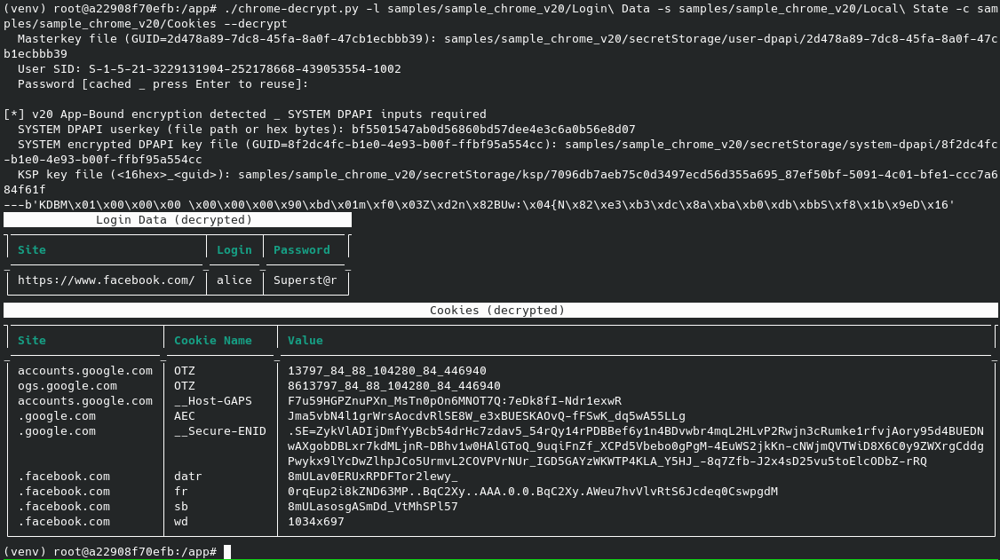

# chrome-decrypt

> Peek inside Chrome's credential vault — passwords, cookies, and the keys that protect them.

> [!WARNING]
> For educational and research purposes only. Use only on systems you own or have explicit permission to examine. Provided as-is, with no warranties of any kind.

---

A proof-of-concept for inspecting and decrypting Chrome's saved credentials and cookies from a Windows profile. Handles all modern Chrome encryption schemes including the [App-Bound Encryption](https://security.googleblog.com/2024/07/improving-security-of-chrome-cookies-on.html) introduced in Chrome 127.

---

## What it does

Chrome stores passwords and cookies in SQLite databases, encrypted with AES-256-GCM. The AES key itself is wrapped with Windows DPAPI. Chrome 127+ adds a second layer called **App-Bound Encryption** — a system-level DPAPI chain involving a KSP (Key Storage Provider) key and a two-stage blob decryption. This tool unravels all of it.

| Encryption version | Chrome era | What's needed to decrypt |
|--------------------|------------|--------------------------|
| Legacy DPAPI       | pre-80     | *(not supported)*        |
| `v10` / `v11`      | 80–126     | user DPAPI masterkey + SID + password |
| `v20`              | 127+       | all of the above, plus SYSTEM DPAPI masterkey + KSP key file |

---

## Requirements

Python 3.10+ required

Install dependencies:
```
pip3 install -r requirements.txt
```


---

## Files you'll need

Grab these from the Windows machine (or image) you're investigating:

| What | Default path |
|------|-------------|
| **Local State** | `%LOCALAPPDATA%\Google\Chrome\User Data\Local State` |
| **Login Data** | `%LOCALAPPDATA%\Google\Chrome\User Data\Default\Login Data` |
| **Cookies** | `%LOCALAPPDATA%\Google\Chrome\User Data\Default\Network\Cookies` |
| **User DPAPI masterkey** | `%APPDATA%\Microsoft\Protect\<SID>\<GUID>` |
| **SYSTEM DPAPI masterkey** *(v20 only)* | `C:\Windows\System32\Microsoft\Protect\S-1-5-18\User\<GUID>` |
| **SYSTEM DPAPI userkey** *(v20 only)* | `C:\Windows\System32\Microsoft\Protect\S-1-5-18\` (the `Preferred` file or a hex blob) |
| **KSP key file** *(v20 only)* | `C:\Windows\ServiceProfiles\LocalService\AppData\Roaming\Microsoft\Crypto\Keys\` |

The tool will tell you the exact GUID it's looking for when it prompts you — no guessing needed.

---

## Usage

### Inspect without decrypting

Just want to see what's in there, and which encryption version each entry uses?

```bash
# Show encryption versions for all logins
./chrome-decrypt.py --info -l "Login Data" -s "Local State"

# Show encryption versions for all cookies
./chrome-decrypt.py --info -c Cookies

# Everything at once
./chrome-decrypt.py --info -l "Login Data" -c Cookies -s "Local State"
```

Output is a pretty Rich table — site, username, and the encryption version tag (`v10`, `v20`, plaintext, etc.).

### Decrypt passwords and cookies

```bash
# Decrypt saved passwords
./chrome-decrypt.py --decrypt -s "Local State" -l "Login Data"

# Decrypt cookies
./chrome-decrypt.py --decrypt -s "Local State" -c Cookies

# Both at once
./chrome-decrypt.py --decrypt -s "Local State" -l "Login Data" -c Cookies
```


On first run, you'll be prompted interactively for the masterkey file path, user SID, and Windows login password. All inputs are cached in `.formdata.json` so subsequent runs pre-fill the values — just press Enter to reuse them.

Tab completion works on file paths. Passwords are prompted with `getpass` (hidden input).

Decryption output example:


### Verbose mode

```bash
./chrome-decrypt.py --decrypt -s "Local State" -c Cookies -v
```

Prints key sizes, DPAPI GUIDs, and intermediate decryption steps — useful when something isn't working and you want to know where it's failing.

---

## How the decryption chain works

### v10 / v11 (Chrome 80–126)

```
Local State  →  base64 decode  →  strip "DPAPI" prefix  →  DPAPIBlob
DPAPIBlob  +  DPAPI masterkey (from SID + password)  →  AES-256 browser key
browser key  +  v10|IV(12b)|ciphertext|TAG(16b)  →  plaintext
```

### v20 App-Bound (Chrome 127+)

```
Local State  →  app_bound_encrypted_key  →  strip "APPB" prefix  →  blob1 (SYSTEM-encrypted)
blob1  +  SYSTEM masterkey  →  blob2 (user-encrypted)
blob2  +  user masterkey  →  header + content

KSP file  →  DPAPI ksp_blob
ksp_blob  +  SYSTEM masterkey  +  entropy  →  BCRYPT_KEY_DATA_BLOB  →  ksp_key (32 bytes)

content[0] (flag):
  1  →  AES-GCM with hardcoded key
  2  →  ChaCha20-Poly1305 with hardcoded key
  3  →  AES-CBC(ksp_key) + XOR  →  AES-GCM  →  v20 browser key
```

---

## Options reference

```
  -l, --logindata PATH   Chrome "Login Data" SQLite file
  -s, --localstate PATH  Chrome "Local State" JSON file
  -c, --cookies PATH     Chrome Cookies SQLite file
      --info             Show encryption versions (no decryption)
      --decrypt          Decrypt passwords/cookies (interactive)
  -v, --verbose          Extra debug output
```

---

## Caching and the `.formdata.json` file

To save you from re-typing paths and credentials on every run, inputs are cached in `.formdata.json` in the current directory. It stores file paths, the user SID, and passwords in plaintext — **treat it like a credential file and delete it when you're done.**

---

## Notes

- Chrome holds locks on its SQLite files while running. The tool automatically works around this by copying the DB to a temp file before opening it.
- The BCRYPT_KEY_DATA_BLOB format (`KDBM` magic header) is parsed correctly — the actual AES key starts at byte 12, not byte 0.
- Cookie plaintexts may include a short binary metadata prefix that Chrome prepends before encrypting; the tool strips it automatically.

